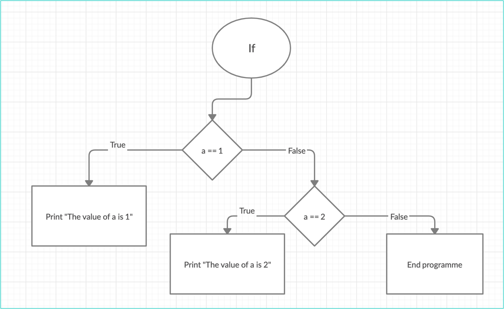
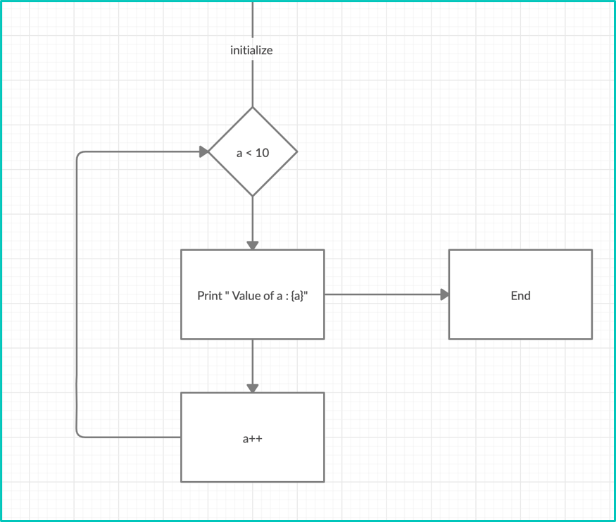
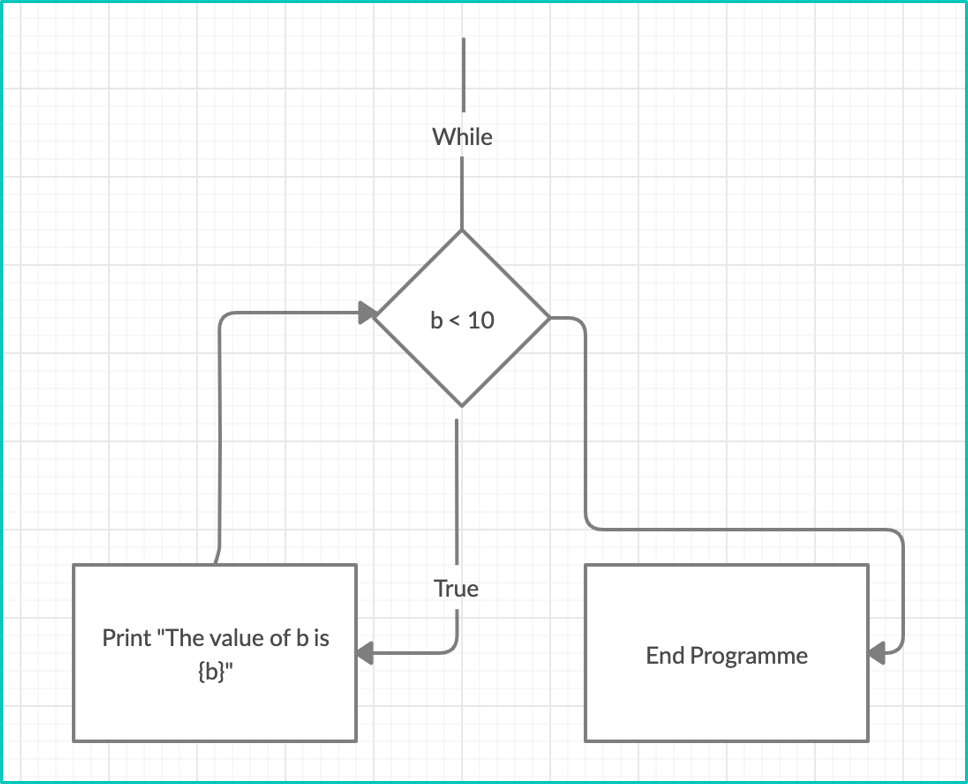

# Lesson 1 Introduction to python
In this lesson we will introduce python:

### Admin
- Course structure
- Class structure
- Course website [link](https://github.com/changetocoding/PyBeginnersKli/)
- Discuss what know about python

### Overview of different programming languages:
- Object Orientated: C++, C#, Java  
- Functional: F#, COBOL, Haskell  
- Scripting: Javascript, Python  
- SQL

Similar to human languages. Tons of them, Some are more popular, some are easier to learn, its easier to express different things in different languages, but they all 'borrow' concepts from each other

### Why python is popular:
R, Mathlab
- Easy to learn
- Loads of maths, data science libraries (so don't have to write complex formulas self)
- Scripted - easy & quick to run/experiment/prototype

### Admin
- Ensure pycharm, python, Notepad++ are all installed and working

### Ways to execute python
- Interpreter sandbox  (Ctrl+Z to exit)
- Execute a script from the command line (python "HelloWorld.py")
- run it in Pycharm (Create a project)

[Videos of how to do it](https://www.changetocoding.co.uk/pythonvideos)

```python
print('hello world')
```

## Let's Code

### Data types 

**string** - words or text. Put text within single or double quotes
```python
name = 'Peter'

full_name = 'Peter ' + 'Parker'
```

**int** - Whole numbers 
```python
x = 10
```

**float** - Represents decimal numbers
```python
y = 10.2
```

Division of ints always gives a float
```python
x = 10
y = 4

# z = 2.5, z is a float
z = x/y

```

What happens here?
```python
x = '12'
y = '12'

# what is z?
z = x + y
```

### Selection ("if")
Indentation is very important! 4 spaces

```python
a = 1

if a == 1:
    print('The value of a is 1')
elif a == 2:
    print('The value of a is 2')
```
 

Another example  
```python
name = 'Peter'

if (name == 'Tom'):
    print('Hello Tom')
elif name == 'Peter':
    print('Hello Peter')
else:
    print('Hi there, ' + name)
```

### Iteration ("for"/ "while" loops)
**For**

```python
for a in range(0, 10):
    print("Value of a is " + str(a))
```
  

**While**

```python
b = 1
while b < 10 :
    print("The value of b is " + str(b))
    b += 1
```
  

While loop. Have to remember to increment unless:
```python
x = 1
while x < 100:
    print("To infinity and beyond! We're getting close..." )
```


### Nested Loops

The 10 times table

```python
for x in range(1, 11):
	for y in range(1, 11):
		answer = x * y
		print(str(x) + " times " + str(y) + " = " + str(answer))
```

### Also covered
- Indentation (4 spaces) is important  
- Python reads the code like a book, and similar to a building ikea furniture goes off and does it
- Difference between:
```python
x = 1 # sets a value
x == 1 # checks a value
```

### Homework

Additional content: pathway for becoming a data scientist [link](https://trello-attachments.s3.amazonaws.com/546e1ae89eadee778ae12bf5/1280x5859/eadbecbe3badba6847e0ea1e629e3827/How-to-become-a-data-scientist.jpg) 

HW: [Hello world](https://www.learnpython.org/en/Hello%2C_World%21)  
HW: [Variables](https://www.learnpython.org/en/Variables_and_Types)    
HW: https://classroom.udacity.com/courses/ud1110 Lesson 1, 2 (Why Python, Data Types & Operators. Apx 3 hours)  
HW: Bart Simpson  
Bart wrote lines on a chalkboard at the start of every Simpsons episode for being naughty. If only he had python...

Your task is to pick a Bart Simpson quote from [here](https://simpsons.fandom.com/wiki/List_of_chalkboard_gags) and create an python script that writes it out 100 times  
```
I will not waste chalk.
I will not waste chalk.
....
```

Email me your bart simpson solutions 11.59pm on Sunday night
